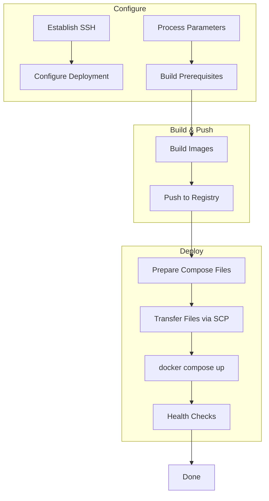

# Aspire Docker SSH Deployment Pipeline

[](https://f.feedz.io/davidfowl/aspire/packages/Aspire.Hosting.Docker.SshDeploy/latest/download)

Deploy Aspire applications to remote Docker hosts via SSH.

## Overview

This package extends Aspire's Docker Compose support with a deployment pipeline that builds container images locally, pushes them to a registry, and deploys to a remote server via SSH. The pipeline handles SSH connection management, file transfers, and container orchestration with `docker compose`.


## How It Works

The deployment pipeline executes in phases, with steps running in parallel where possible:



**Phase breakdown:**
1. **Configure** - Establish SSH connection, gather parameters (registry, credentials, deploy path)
2. **Build** - Build container images for each project in parallel
3. **Push** - Push images to the configured container registry
4. **Deploy** - Transfer compose files and `.env` to the remote server, run `docker compose up`
5. **Verify** - Run health checks, extract dashboard token, cleanup SSH

Run `aspire do diagnostics` to see the full dependency graph for your application.

## Quick Start

1. Add the package feed:

```bash
dotnet nuget add source https://f.feedz.io/davidfowl/aspire/nuget/index.json --name davidfowl-aspire
```

2. Install the package:

```bash
aspire add docker-sshdeploy
```

Or with the .NET CLI:

```bash
dotnet add package Aspire.Hosting.Docker.SshDeploy --prerelease
```

3. Add SSH deployment support to your AppHost:

```csharp
builder.AddDockerComposeEnvironment("env")
    .WithSshDeploySupport();
```

3. Deploy:

```bash
aspire deploy
```

The pipeline will prompt for SSH credentials, registry configuration, and deploy path.

## Documentation

See the [package README](src/Aspire.Hosting.Docker.SshDeploy/README.md) for:
- Configuration options (`appsettings.json`, environment variables)
- SSH authentication (key-based vs password)
- Target host privacy settings

## Sample Project

See `samples/DockerPipelinesSample` for a complete example:

```bash
aspire run     # Run locally
aspire deploy  # Deploy to remote host
```

## CI/CD with GitHub Actions

See `.github/workflows/deploy.yml` for a complete example using GitHub Container Registry with secrets for SSH credentials.
